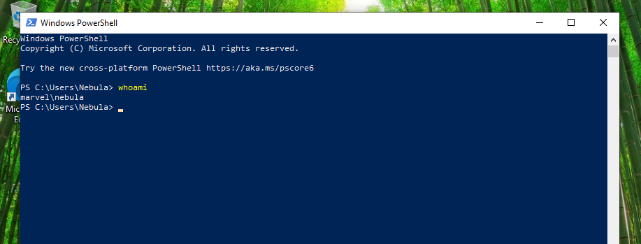
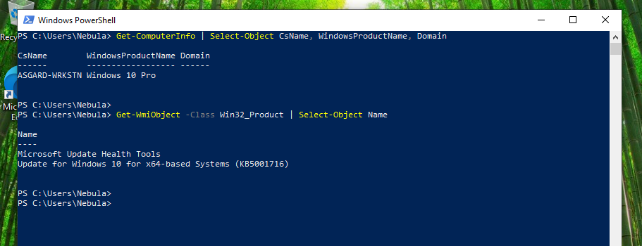
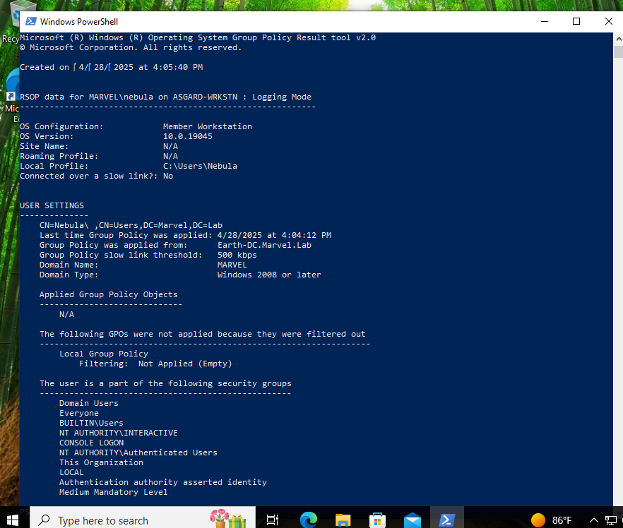

# 🖥️ Workstation VM Deployment – Marvel Lab

 <!-- Replace this with a cover image -->

---

## 📘 Introduction

This project simulates the deployment of Windows 10 workstations in a virtual environment using a Marvel-themed Active Directory domain. The goal is to automate endpoint provisioning, domain integration, and policy enforcement using PowerShell. This type of setup is essential for Blue Team roles, system administrators, and security engineers looking to simulate a real-world enterprise network.

---

## 🎯 Objectives

- Deploy Windows 10 virtual machines
- Configure workstations to join an Active Directory domain
- Use PowerShell to automate setup tasks
- Apply and validate Group Policy Objects (GPOs) and endpoint protection

---

## 🧰 Tools & Technologies

| Tool/Service         | Purpose                                 |
|----------------------|------------------------------------------|
| Windows 10 VM        | Workstation image                        |
| Active Directory     | Domain services and authentication       |
| PowerShell           | Automation and scripting                 |
| Marvel Lab Scripts   | Pre-built PowerShell module for the lab  |

---

## 🧪 Lab Setup

### ✅ Step 1: Environment Preparation

1. Deploy a Windows 10 VM (VirtualBox, VMware, or Hyper-V).
2. Set the DNS server on the VM to the IP address of your Marvel Lab Domain Controller.
3. Test connectivity to the domain controller:

```powershell
ping marvel.local
```

---

### ✅ Step 2: Clone Marvel Lab Repo

```powershell
git clone https://github.com/jsecurity101/Marvel-Lab.git
cd Marvel-Lab
```

---

### ✅ Step 3: Import the PowerShell Module

```powershell
Import-Module .\Marvel-Lab.psd1
```

---

### ✅ Step 4: Run Deployment Script

```powershell
Rename-Workstation -Automate
```

> This command renames the VM, joins it to the Marvel domain, installs necessary tools, applies group policies, and reboots the machine.

---

### ✅ Step 5: Validate Configuration

After reboot, open PowerShell and run:

```powershell
whoami          # Confirm domain login
gpresult /r     # Confirm GPO application
```

Also verify:
- Antivirus/monitoring tools are installed
- Host appears in Active Directory under the correct OU

---

## 📸 Screenshots

| Description                    | Screenshot                     |
|---------------------------------|--------------------------------|
| Workstation joined to domain    |  |
| PowerShell script in action     |  |
| Group Policy result             |     |


---

## ✅ Key Takeaways

- ✅ Automated domain joining using PowerShell  
- ✅ Centralized management using GPOs  
- ✅ Practice simulating enterprise workstation deployment  
- ✅ Demonstrated scripting and system configuration skills  

---

## 📎 References

- [Marvel Lab GitHub Repository](https://github.com/jsecurity101/Marvel-Lab)

---

## 📬 About Me

👋 I'm **Zee**, a cybersecurity analyst passionate about building secure environments, defending systems, and simulating real-world network operations. This lab helped refine my system automation, Active Directory, and incident response readiness.

🔗 [Connect with me on LinkedIn](https://www.linkedin.com/in/zee-williams)  
🔍 [View more labs on my GitHub](https://github.com/zeewilliams)
```

